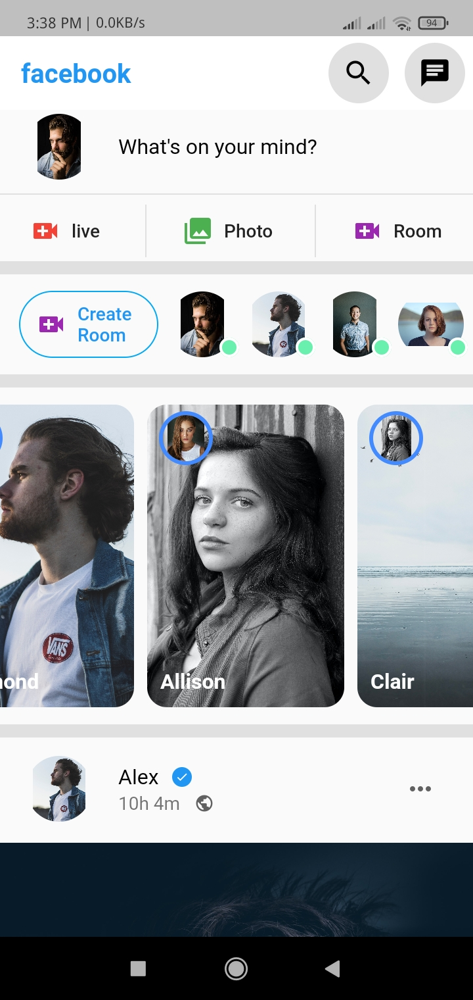
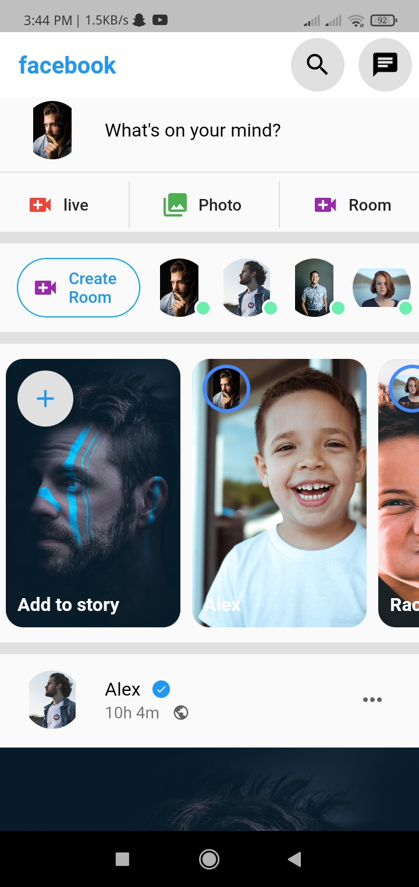
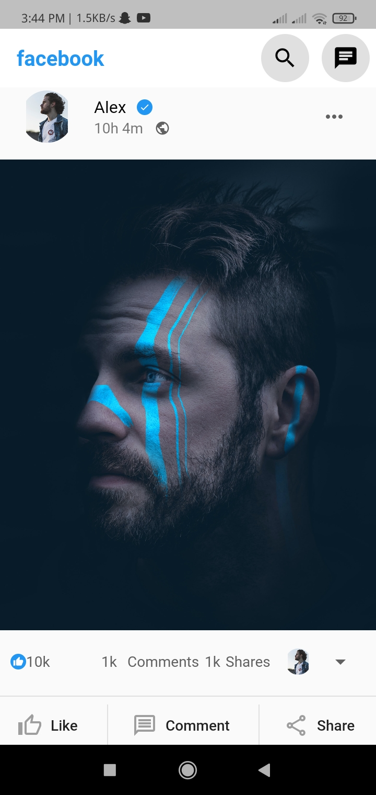
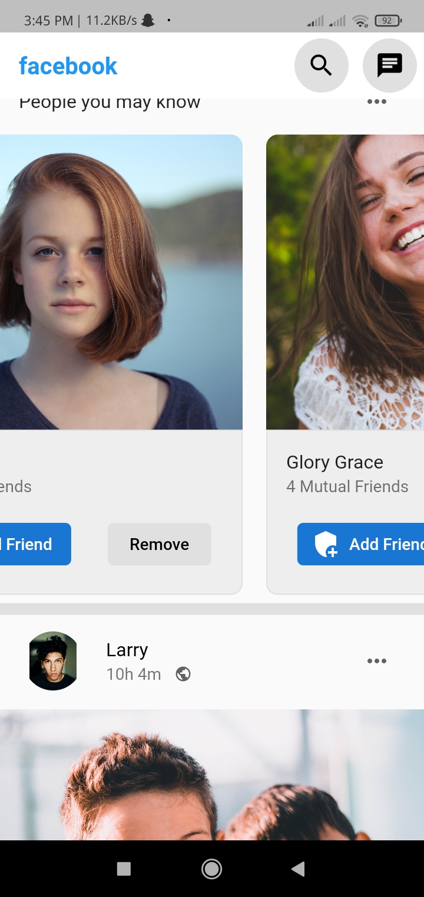
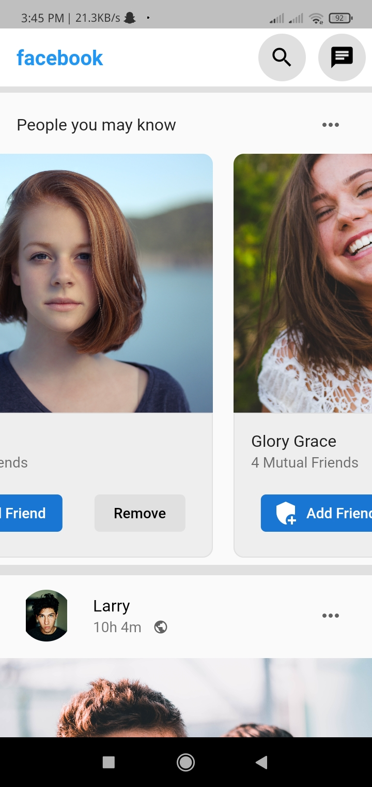
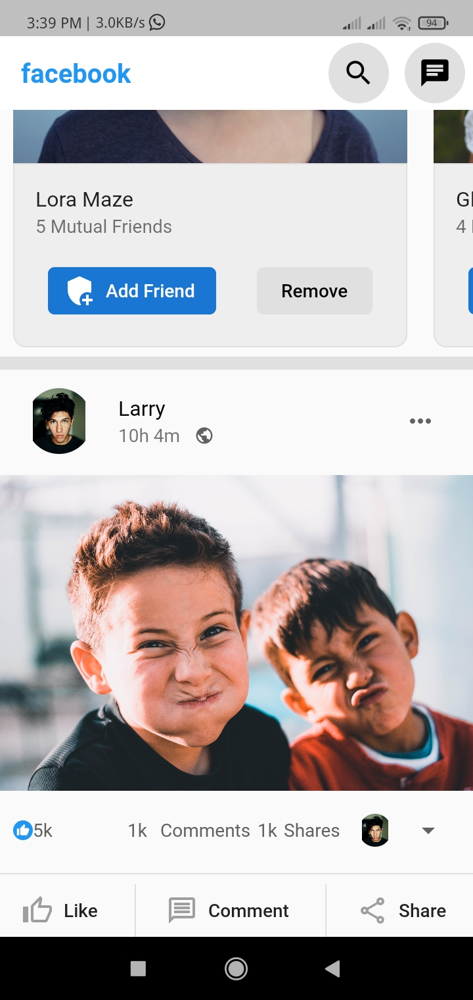

# facebook

A new Flutter project.
Recreate facebook android or IOS app UI using flutter.

## Getting Started

This project is a starting point for a Flutter application.

A few resources to get you started if this is your first Flutter project:

- [Lab: Write your first Flutter app](https://flutter.dev/docs/get-started/codelab)
- [Cookbook: Useful Flutter samples](https://flutter.dev/docs/cookbook)

Main Widgets used
- Scaffold
- AppBar
- ListView
- Flutter Icons
- Column
- ListTiles
- Row

# Screenshots

{ width: 200px; }

